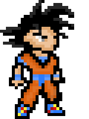

# 7balls

> :video_game: Gra webowa oparta na anime "Dragon Ball"

## Gdzie można zagrać?

Aplikacja dostępna jest pod adresem: http://piecioshka.github.io/7balls/

## Wsparcie

Wspierane są wszystkie najnowsze wersje przeglądarek 

* Google Chrome
* Mozilla Firefox
* Safari
* Opera
* IE
* Edge

oraz systemy operacyjne:

* MS Windows
* Linux
* Mac OS X 

## Geneza projektu

Gra była realizowana na potrzeby stworzenia 
[prezentacji](https://www.youtube.com/watch?v=klDeljOKDjU) na WarsawJS.

Podczas tworzenia projektu powstało 25 filmów na temat tego projektu.
Wszystkie materiały znajdują się na kanale YouTube autora.
[Playlista](https://www.youtube.com/playlist?list=PLDTdlgCXlVhjAlKJ1W2Y12Xejvt4Ih02p)
zawiera kompletną listę odcinków w chronologicznej postaci.

## TODO LIST

* [ ] dodać ekran, gdzie leci się z lewej na prawo i robi uniki od potworów
* [ ] dodać ekran, gdzie broni się rannego przyjaciela, a atakuje kilku `Cell Jr.`
* [ ] dodać tryb `fullscreen`
* [ ] dodać faktyczny `konami code` - https://github.com/mikeflynn/egg.js
* [ ] czy trzeba tworzyć nowy zegar? (`game.time.create()`) czy nie można
skorzystać z już istniejącego? (`this.time.events.add`)
* [ ] po porażce przegrany powinien leżeć na ziemi
* [ ] narysować Son Goku, który robi "Kamehameha" i użyć jako loader podczas ładowania gry
* [ ] narysować obrazek 526x275, który będzie plakatem gry (Open Graph).

## Interesujące źródła

- https://www.wykop.pl/link/2734787/goku-vs-street-fighter-2/
- https://i.pinimg.com/236x/bc/3b/a9/bc3ba9721a4698e58055a748efb2fb21.jpg
- https://i.pinimg.com/236x/2f/d2/b7/2fd2b78b17f8eeebf7ad7368f2e8c8d3.jpg
- https://i.pinimg.com/236x/55/fc/a8/55fca80f935845e7a4cdcb74d436ec85.jpg

## Licencja

Copyright @ 2015
