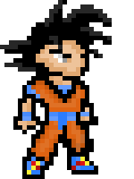

# [7balls](http://www.7balls.game)

> :video_game: Gry webowa oparta na anime "Dragon Ball"

# KA ME HA ME HA!!!!

 

## Gdzie można zagrać?

Wspierane są wszystkie najnowsze wersje przeglądarek oraz systemy operacyjne:
MS Windows, Linux, Mac OS X. Aplikacja dostępna jest pod adresem: 
http://www.7balls.game

## Geneza projektu

Gra była realizowana na potrzeby stworzenia 
[prezentacji](https://www.youtube.com/watch?v=klDeljOKDjU) na WarsawJS.

Podczas tworzenia projektu powstało 25 filmów na temat tego projektu.
Wszystkie materiały znajdują się na kanale YouTube autora.
[Playlista](https://www.youtube.com/playlist?list=PLDTdlgCXlVhjAlKJ1W2Y12Xejvt4Ih02p)
zawiera kompletną listę odcinków w chronologicznej postaci.

## TODO LIST

* [ ] dodać ekran, gdzie leci się z lewej na prawo i robi uniki od potworów
* [ ] dodać ekran, gdzie broni się rannego przyjaciela, a atakuje kilku `Cell Jr.`
* [ ] dodać tryb `fullscreen`
* [ ] dodać faktyczny `konami code` - https://github.com/mikeflynn/egg.js
* [ ] czy trzeba tworzyć nowy zegar? (`game.time.create()`) czy nie można
skorzystać z już istniejącego? (`this.time.events.add`)
* [ ] po porażce przegrany powinien leżeć na ziemi
* [ ] narysować Son Goku, który robi "Kamehameha" i użyć jako loader podczas ładowania gry
* [ ] narysować obrazek 526x275, który będzie plakatem gry (Open Graph).

## Autor

Kontakt do autora aplikacji:

 * Twitter: [@piecioshka](http://twitter.com/piecioshka)
 * Wykop: [@piecioshka](http://wykop.pl/profile/piecioshka)
 * Blog: [piecioshka.pl/blog](http://piecioshka.pl/blog/)

---

@ 2015
